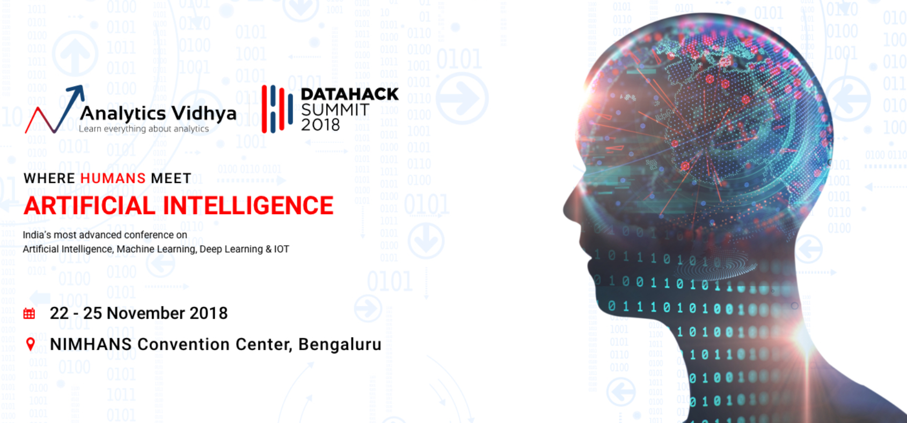

# Effective Feature Engineering
### A Structured Approach to Building Better Machine Learning Models

Feature engineering, Data wrangling and Visualization are all aspects of Data Preparation – one of the most important phases in any standard data mining or machine learning workflow. 

Dipanjan Sarkar, Data Scientist\Author and your Hacker for this session, believes feature engineering is both an art as well as a science.

> “Coming up with features is difficult, time-consuming, requires expert knowledge. ‘Applied machine learning’ is basically feature engineering” – Prof. Andrew Ng

Even with the advent of automated machine learning tools (Auto-ML) and automated feature engineering libraries, more than often, creative and innovative hand-crafted features can often be the deciding factor in winning competitions or getting a real-world project from being a proof of concept to being deployed in production.

This repository contains code and presentation for my one hour interactive hack session, _'Effective Feature Engineering: A Structured Approach to Building Better Machine Learning Models'_ where we look at two interesting case studies on how to effectively leverage feature engineering and use a structured approach to build good machine learning models. This is created for the purpose of being presented in Analytics Vidhya's DataHack Summit 2018.

## Case Study 1: New York City Taxi Fare Prediction

In Case Study 1, we will look at predicting taxi fare prices around New York City. This will be a regression problem at scale where we will be dealing with millions of data points! We will start with building a simple baseline model and then incrementally build on our baseline model with a wide variety of feature engineering techniques which include the following.

- Outlier Analysis and Removal
- Temporal Features based on Date & Time
- Geographic Distance Features
- Visualizing Frequent Trip Patterns
- Hand-crafting trip trends into features
- Features based on trip locations and duration
- Categorical features based on trending locations

## Case Study 2: Predicting E-Commerce Product Recommendation Ratings from Reviews

In Case Study 2, we will explore another interesting dataset pertaining to e-commerce product reviews and ratings. Here we tackle a classification problem of trying to predict recommended product ratings based on the customer review descriptions – a classic NLP problem! Here we will explore the following techniques in detail.

- Classic NLP count based features from text
- Features based on POS Tags
- Features derived from Sentiment Analysis
- Text Pre-processing & Wrangling
- Classic Bag of Words based Features
- Bi-grams and Tri-grams with intelligence feature selection

At every stage we will build relevant models and test the performance and effectiveness of each featureset which we generate incrementally and finally conclude with the best model and set of relevant features.

 

### Key Takeaways from this Hack Session:

- Understand the need and importance of feature engineering, data wrangling and visualization
- Look at real-world problems where hand-crafted features and human domain expertise might be more useful than randomly building a bunch of features or models using automated techniques or meta-heuristics
- Hands-on demonstration of feature engineering and machine learning modeling on big datasets having millions of data points
- Comprehensive coverage of popular feature engineering techniques for structured data including numeric, categorical, temporal and geospatial features
- Comprehensive coverage of popular feature engineering techniques for unstructured text data including count based features, POS tags, sentiment analysis, bag of words and so on
- Notebooks are shared here for you to take home and use them in your own problems in the future!
